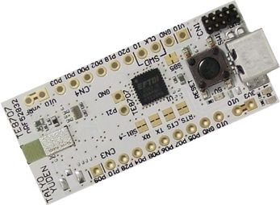

.. _ebshsnzwz_nrf52832:

EBSHSNZWZ
########

Overview
********

The EKSHSNZWZ Development Kit hardware provides
support for the Nordic Semiconductor nRF52832 ARM Cortex-M4F CPU and
the following devices:

* :abbr:`ADC (Analog to Digital Converter)`
* CLOCK
* FLASH
* :abbr:`GPIO (General Purpose Input Output)`
* :abbr:`I2C (Inter-Integrated Circuit)`
* :abbr:`MPU (Memory Protection Unit)`
* :abbr:`NVIC (Nested Vectored Interrupt Controller)`
* :abbr:`PWM (Pulse Width Modulation)`
* RADIO (Bluetooth Low Energy)
* :abbr:`RTC (nRF RTC System Clock)`
* Segger RTT (RTT Console)
* :abbr:`SPI (Serial Peripheral Interface)`
* :abbr:`UART (Universal asynchronous receiver-transmitter)`
* :abbr:`WDT (Watchdog Timer)`

     EBSHSNZWZ (Credit: TAIYO YUDEN)

More information about the board can be found at the
`TAIYO YUDEN website`_. The `Nordic Semiconductor Infocenter`_
contains the processor's information and the datasheet.

Hardware
********

TAIYO YUDEN has two external oscillators. The frequency of
the slow clock is 32.768 kHz. The frequency of the main clock
is 32 MHz.

Supported Features
==================

The ebshsnzwz_nrf52832 board configuration supports the following
hardware features:

+-----------+------------+----------------------+
| Interface | Controller | Driver/Component     |
+===========+============+======================+
| ADC       | on-chip    | adc                  |
+-----------+------------+----------------------+
| CLOCK     | on-chip    | clock_control        |
+-----------+------------+----------------------+
| FLASH     | on-chip    | flash                |
+-----------+------------+----------------------+
| GPIO      | on-chip    | gpio                 |
+-----------+------------+----------------------+
| I2C(M)    | on-chip    | i2c                  |
+-----------+------------+----------------------+
| MPU       | on-chip    | arch/arm             |
+-----------+------------+----------------------+
| NVIC      | on-chip    | arch/arm             |
+-----------+------------+----------------------+
| PWM       | on-chip    | pwm                  |
+-----------+------------+----------------------+
| RADIO     | on-chip    | Bluetooth            |
+-----------+------------+----------------------+
| RTC       | on-chip    | system clock         |
+-----------+------------+----------------------+
| RTT       | Segger     | console              |
+-----------+------------+----------------------+
| SPI(M/S)  | on-chip    | spi                  |
+-----------+------------+----------------------+
| UART      | on-chip    | serial               |
+-----------+------------+----------------------+
| WDT       | on-chip    | watchdog             |
+-----------+------------+----------------------+

Other hardware features are not supported by the Zephyr kernel.
See `nRF52 DK website`_ and `Nordic Semiconductor Infocenter`_
for a complete list of nRF52 Development Kit board hardware features.

Connections and IOs
===================

LED
---

* LED1 (green) = P0.18
* LED2 (yellow) = P0.20

Push buttons
------------

* BUTTON1 = SW2 = P0.4
* BOOT = SW1 = boot/reset

External Connectors
-------------------

J-Link Prog Connector

+-------+--------------+
| PIN # | Signal Name  |
+=======+==============+
| 1     | VDD          |
+-------+--------------+
| 2     | IMCU_TMSS    |
+-------+--------------+
| 3     | GND          |
+-------+--------------+
| 4     | IMCU_TCKS    |
+-------+--------------+
| 5     | V5V          |
+-------+--------------+
| 6     | IMCU_TDOS    |
+-------+--------------+
| 7     | Cut off      |
+-------+--------------+
| 8     | IMCU_TDIS    |
+-------+--------------+
| 9     | Cut off      |
+-------+--------------+
| 10    | IMCU_RESET   |
+-------+--------------+

Debug IN

+-------+--------------+-------------------------+
| PIN # | Signal Name  | NRF52832 Functions      |
+=======+==============+=========================+
| 1     | VDD          | N/A                     |
+-------+--------------+-------------------------+
| 2     | SWDIO        | SWDIO                   |
+-------+--------------+-------------------------+
| 3     | GND          | N/A                     |
+-------+--------------+-------------------------+
| 4     | SWDCLK       | SWDCLK                  |
+-------+--------------+-------------------------+
| 5     | GND          | N/A                     |
+-------+--------------+-------------------------+
| 6     | P0.18        | P0.18 / TRACEDATA[0] /  |
|       |              | SWO                     |
+-------+--------------+-------------------------+
| 7     | Cut off      | N/A                     |
+-------+--------------+-------------------------+
| 8     | Cut off      | N/A                     |
+-------+--------------+-------------------------+
| 9     | GND          | N/A                     |
+-------+--------------+-------------------------+
| 10    | P0.21        | P0.21 / RESET           |
+-------+--------------+-------------------------+

Debug OUT

+-------+----------------+
| PIN # | Signal Name    |
+=======+================+
| 1     | EXT_VTG        |
+-------+----------------+
| 2     | EXT_SWDIO      |
+-------+----------------+
| 3     | GND            |
+-------+----------------+
| 4     | EXT_SWDCLK     |
+-------+----------------+
| 5     | GND            |
+-------+----------------+
| 6     | EXT_SWO        |
|       |                |
+-------+----------------+
| 7     | Cut off        |
+-------+----------------+
| 8     | Cut off        |
+-------+----------------+
| 9     | EXT_GND_DETECT |
+-------+----------------+
| 10    | EXT_RESET      |
+-------+----------------+

Shield Debug and Current measurement

+-------+----------------+
| PIN # | Signal Name    |
+=======+================+
| 1     | VDD_nRF        |
+-------+----------------+
| 2     | VDD            |
+-------+----------------+
| 3     | SH_VTG         |
+-------+----------------+
| 4     | SH_SWDIO       |
+-------+----------------+
| 5     | SH_SWDCLK      |
+-------+----------------+
| 6     | SH_SWO         |
+-------+----------------+
| 7     | SH_RESET       |
+-------+----------------+
| 8     | SH_GND_DETECT  |
+-------+----------------+

Auxiliary

+-------+--------------+-------------------------+
| PIN # | Signal Name  | NRF52832 Functions      |
+=======+==============+=========================+
| 1     | P0.00        | P0.00 / XL1             |
+-------+--------------+-------------------------+
| 2     | P0.01        | P0.01 / XL2             |
+-------+--------------+-------------------------+
| 3     | P0.21        | P0.21 / RESET           |
+-------+--------------+-------------------------+
| 4     | P0.05_C      | P0.05 / AIN3            |
+-------+--------------+-------------------------+
| 5     | P0.06_C      | P0.06                   |
+-------+--------------+-------------------------+
| 6     | P0.07_C      | P0.07                   |
+-------+--------------+-------------------------+
| 7     | P0.08_C      | P0.08                   |
+-------+--------------+-------------------------+
| 8     | P0.09        | P0.09 / NFC1            |
+-------+--------------+-------------------------+
| 9     | P0.10        | P0.10 / NFC2            |
+-------+--------------+-------------------------+

Programming and Debugging
*************************

Flashing
========

Follow the instructions in the :ref:`nordic_segger` page to install
and configure all the necessary software. Further information can be
found in :ref:`nordic_segger_flashing`. Then build and flash
applications as usual (see :ref:`build_an_application` and
:ref:`application_run` for more details).

Here is an example for the :ref:`hello_world` application.

First, run your favorite terminal program to listen for output.

.. code-block:: console

   $ minicom -D <tty_device> -b 115200

Replace :code:`<tty_device>` with the port where the board nRF52 DK
can be found. For example, under Linux, :code:`/dev/ttyACM0`.

Then build and flash the application in the usual way.

.. zephyr-app-commands::
   :zephyr-app: samples/hello_world
   :board: nrf52dk_nrf52832
   :goals: build flash

Debugging
=========

Refer to the :ref:`nordic_segger` page to learn about debugging Nordic boards with a
Segger IC.

Testing the LEDs and buttons in the nRF52 DK
********************************************

There are 2 samples that allow you to test that the buttons (switches) and LEDs on
the board are working properly with Zephyr:

.. code-block:: console

   samples/basic/blinky
   samples/basic/button

You can build and flash the examples to make sure Zephyr is running correctly on
your board. The button and LED definitions can be found in
:zephyr_file:`boards/arm/nrf52dk_nrf52832/nrf52dk_nrf52832.dts`.

References
**********

.. target-notes::

.. _nRF52 DK website: https://www.nordicsemi.com/Software-and-Tools/Development-Kits/nRF52-DK
.. _Nordic Semiconductor Infocenter: https://infocenter.nordicsemi.com
